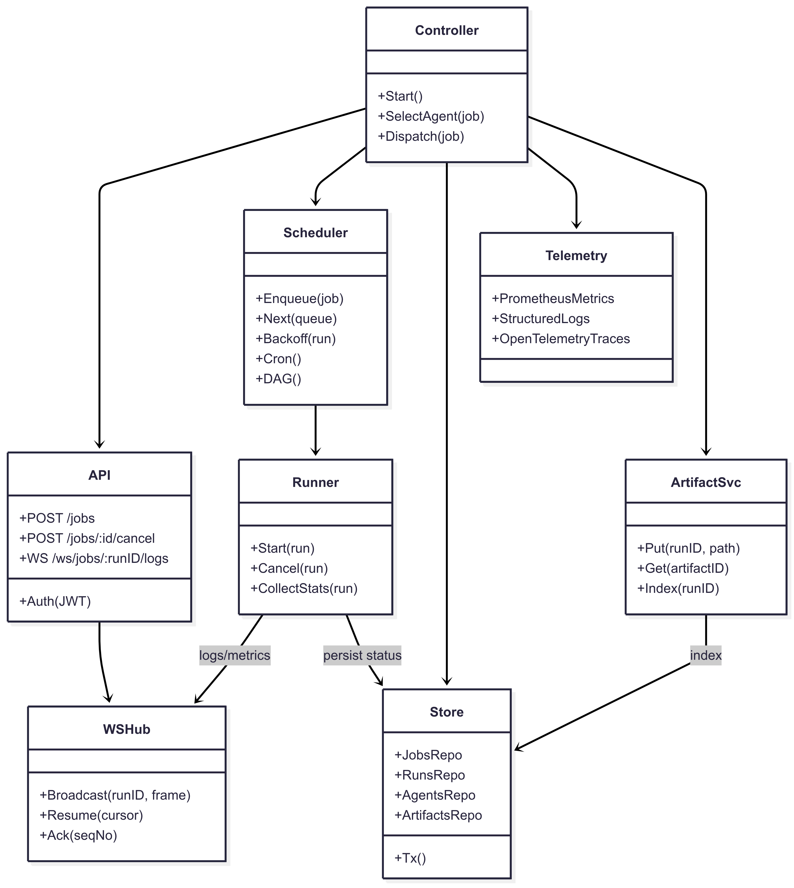
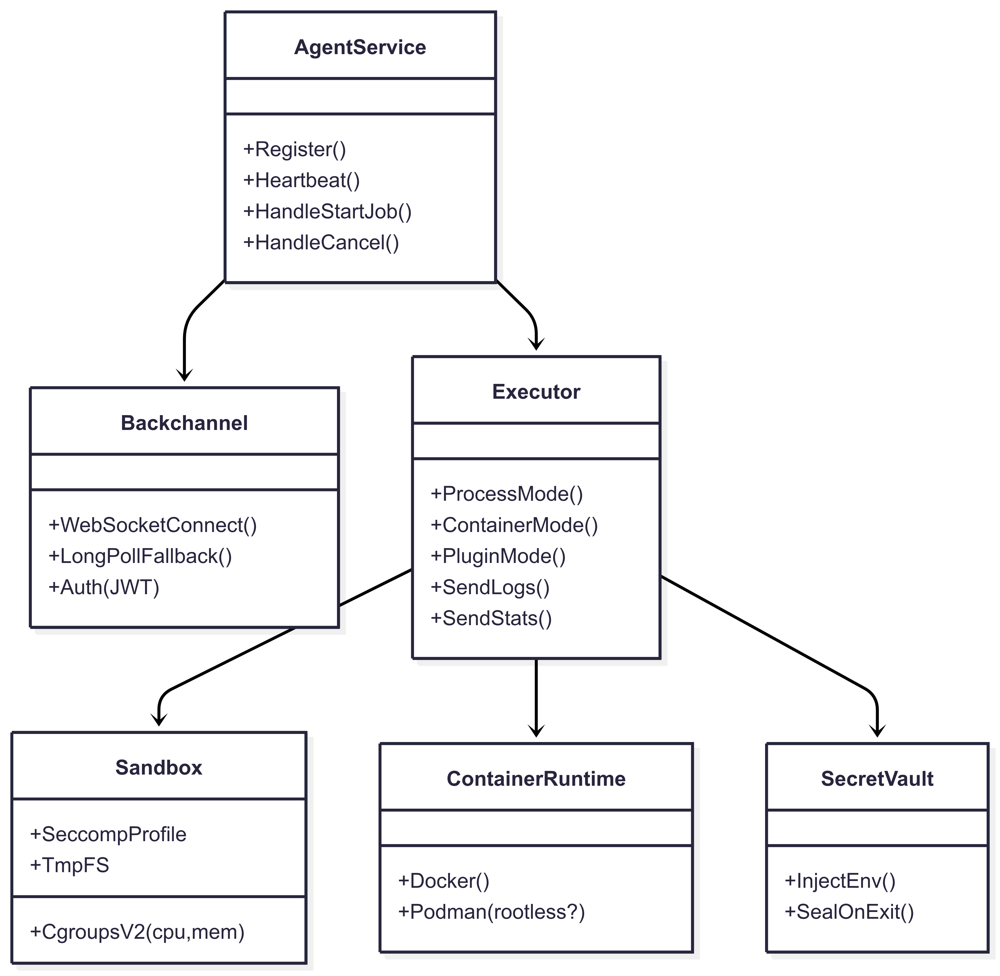
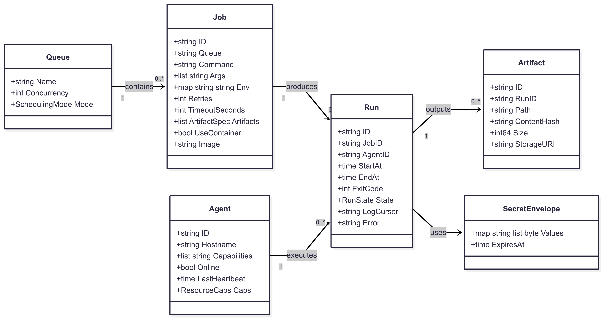

---

## title: Architecture

---

# Architecture

This page summarizes NomadLite’s architecture and links to the main design diagrams.

## High‑level components

* **Controller (Go):** API, scheduler, runner, artifact index, telemetry
* **Agents (Go/systemd):** secure backchannel, executor, sandbox (cgroups/seccomp)
* **Web UI (Angular):** dashboard, job forms, live log viewer
* **Persistence:** PostgreSQL/SQLite; Artifacts in S3/MinIO or filesystem

---

## Backend Structure

```
backend/
├── cmd/
│   ├── controller/ (main.go)
│   └── agent/ (main.go)
├── internal/
│   ├── api/
│   ├── scheduler/
│   ├── runner/
│   ├── store/
│   ├── artifacts/
│   ├── telemetry/
│   ├── auth/
│   ├── ws/
│   ├── config/
│   └── utils/
├── migrations/
├── deployments/
│   ├── systemd/
│   └── docker/
├── scripts/
├── go.mod
└── go.sum
```

## UI Structure (Angular)

```
ui/
├── angular.json
├── package.json
├── tsconfig.json
└── src/
    ├── app/
    │   ├── core/
    │   ├── shared/
    │   ├── features/
    │   ├── pages/
    │   └── routes.ts
    ├── assets/
    ├── environments/
    │   ├── environment.ts
    │   └── environment.prod.ts
    ├── index.html
    ├── main.ts
    └── styles.css
```

---

## Controller Internals



---

## Agent Internals



---

## Domain Model



---

## Additional Diagrams

* [Domain Model (Mermaid)](diagrams/domain-model.md)
* [Controller Internals (Mermaid)](diagrams/controller-internals.md)
* [Agent Internals (Mermaid)](diagrams/agent-internals.md)
* [Backend Tree](diagrams/backend-tree.md)
* [UI Tree](diagrams/ui-tree.md)
* [Project Tree](diagrams/project-tree.md)
